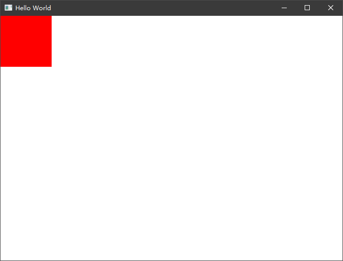
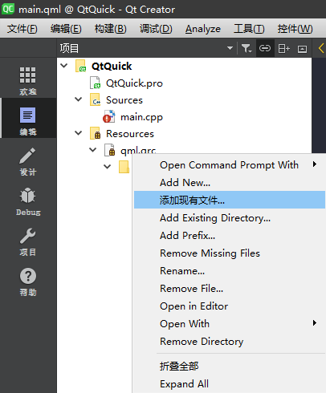

# What's QML

在上一篇介绍中，我们了解到 Qt Quick 项目的 UI 资源是通过 QML 描述的，它与 Duilib 的 xml 起到同样的作用，描述 UI 是如何展示的。但他不仅仅能描述一个窗口或者控件的样式，它还有一些更强大的功能允许我们通过前端即可控制一些业务逻辑。

## Item

除了上文中我们看到的 Window 和我们尚未接触到的 ApplicationWindow 以外，QML 几乎所有其他组件都是基于一个基础 Item 衍生而来的。这里有一幅网友整理的关系图，来自 [https://github.com/CodeBees/QMLClassDiagram](https://github.com/CodeBees/QMLClassDiagram)，此图清晰的展示了 QML 所有 Items 的关系


可以看到，几乎所有 QML 可视的资源几乎都派生于 Item，在 C++ 中实际都是基于 QObject。包括布局（Layouts）、常用控件（Controls），后面我们提到 Item 将泛指这些 Item 派生的子对象。

## 组件（[Components](https://doc.qt.io/qt-5/qml-qtqml-component.html)）

QML 是一个全新的描述型语言，书写风格与 Json 较像，但并不是纯 Json 格式。像上一篇文章我们看到的窗口描述文件，它允许我们创建一个根，在根的基础之上再去嵌入其他的内容（Qt Quick 新版本中已经允许使用内联组件，更多请参考 Qt 官方文档）。

Qt Quick 官方文档中是这样描述 Component 的，`Components are reusable, encapsulated QML types with well-defined interfaces.`。它是一个具有良好的接口、封装好的、可重用的 QML 类型。它最终是一个 `.qml` 文件的形式存在（或者编写内联代码被包含在一个 .qml 文件中以 Component 为根。），下面是一个 Qt Quick 官方文档中的简单示例。

```QML
import QtQuick 2.0

Item {
    width: 100; height: 100
}
```

将以上代码保存为一个单独的 `MyItem.qml` 文件后，我们就可以把它当做一个组件（Component）来引用：

```QML
import QtQuick 2.12
import QtQuick.Window 2.12

Window {
    visible: true
    width: 640
    height: 480
    title: qsTr("Hello World")

    MyItem {

    }
}
```

此时我们的 Window 就具有了一个宽度为 100、高度为 100 的 Item 组件，它只是一个简单的示例，并没有展示任何内容。

组件是具有自己的生命周期的，在 MyItem.qml 文件中，我们写下如下代码然后运行应用：

```QML
import QtQuick 2.0

Item {
    width: 100; height: 100

    Component.onCompleted: {
        console.log('MyItem component onCompleted')
    }

    Component.onDestruction: {
        console.log('MyItem component onDestruction')
    }
}
```

我们会看到控制台打印了如下内容：

```
qml: MyItem component onCompleted
```

这代表了组件已经加载完成，我们可以根据外部传入的一些参数对组件中要展示的界面进行初始化。当我们关闭程序时，这个组件随之销毁，在控制台会看到如下打印：

```
qml: MyItem component onDestruction
```

生命周期的管理很实用，我们经常通过组件的创建完成和销毁机制来对组件内部的一些资源做初始化或与 C++ 层做相应的通讯来保证时序。美中不足的是它并不像 React、Vue 这类前端框架一样，可以更细颗粒度的在组件创建前、创建后、销毁前、销毁后等情况下做不同的操作。

以上介绍到的是编译前声明式创建组件，我们还可以通过动态创建组件的方式来满足不同场景的需求 `Qt.createComponent()`，这些我们在后面将会介绍。

## 属性绑定（[Binding](https://doc.qt.io/qt-5/qml-qtqml-binding.html)）

与 Duilib 中 XML 纯描述性语言不同，QML 允许不同的组件属性进行绑定，如下示例：

```QML
import QtQuick 2.12
import QtQuick.Window 2.12

Window {
    visible: true
    width: 640
    height: 480
    title: qsTr("Hello World")

    Rectangle {
        id: rect1
        width: 100
        height: 200
        color: 'red'
    }

    Rectangle {
        id: rect2
        width: rect1.width
        height: rect1.height
        color: 'black'
    }
}
```

我们让 rect2 的宽和高与 rect1 保持一致，当 rect1 的宽高变更时，rect2 会跟随变更。我们还没有接触更多的组件，这里仅介绍简单的属性绑定原理，当随着了解的越来越多时，您将了解多更多关于属性绑定的细节。

## 信号连接（[Connections](https://doc.qt.io/qt-5/qml-qtqml-connections.html)）

Qt Widgets 中经常提到的就是信号和槽，同样在 QML 中，这个特性被延续了下来。一个简单的示例如下：

```QML
MouseArea {
    onClicked: { foo(parameters) }
}
```

MouseArea 是一个描述了鼠标区域的组件，它可以响应鼠标的单击事件，MouseArea 有一个默认的 clicked() 信号，如果我们要响应 clicked() 信号，则在信号前加 on 并将信号首字母大写后连接到一起即可，像上面的例子 `on + Clicked` 组成了一个概念上的槽函数。

除了这些预定义的信号以外，组件的任意一个属性（Properties）的变更我们都可以通过这种方式检测到，比如在 MouseArea 中有一个属性是 hoverEnabled，设置为 true 表示该鼠标区域接受鼠标悬浮事件，反之则不接受。我们希望检测这个属性的变更可以这样写：

```QML
MouseArea {
    hoverEnabled: false
    onHoverEnabledChanged: {
        
    }
}
```

类似的一些组件的 visible、height、width 等属性，都可以通过这种方式检测到。但是某些场景下这样单一的信号连接可能无法满足我们的需求，比如：

 - 需要多次连接到一个信号，当信号发出时多个连接同时响应
 - 发出的信号可能并不在同一个文件或区域
 - 这些连接目标可能并不是定义在 QML 中

这些问题我们可以通过 Connections 来解决，首先我们要给 MouseArea 定义一个 ID：

```QML
MouseArea {
    id: area
}
```

随后我们可以在任意可以访问到该 id 的文件或者组件中使用 Connections 连接该信号，如下所示：

```QML
Connections {
    target: area
    onClicked: {

    }
}
```

Qt 5.15 中的新写法

```QML
Connections {
    target: area
    function onClicked(mouse) {
        foo(mouse)
    }
}
```

## 状态（Stats）

待补充

## 动画（Transitions）

待补充

## QML 中使用 JavaScript

在上面的一些示例中，信息的读者不难发现，像 Qt5.15 中推荐的信号连接函数写法是一个 JavaScript 风格的函数。没错，在 QML 中允许你将各种表达式和方法定义为 JavaScript 函数，并且你可以将单独的一个 JavaScript 工具文件导入到工程中使用。先看一个简单的例子：

```
import QtQuick 2.12
import QtQuick.Window 2.12

Window {
    id: mainWindow
    visible: true
    width: 640
    height: 480
    title: qsTr("Hello World")

    Rectangle {
        id: rect
        width: 100
        height: 100
        color: mainWindow.width > 640 ? 'red' : 'black'
    }
}
```

上面例子中 Rectangle 的 color 属性代表该矩形区域的背景色，我们使用了 JavaScript 的三目运算符来判断，当主窗口的宽度 width 属性大于 640 的时候，color 属性为 red，否则 color 属性为 black。你可以通过拖动窗口大小来查看一下左上角矩形区域的颜色变化。


窗口宽度大于 640 后矩形区域颜色变色红色。



你同样可以定义一个 JavaScript 函数来帮助你处理 QML 语法处理不了的事情，比如做一个数据的排序、比如使用 JavaScript 中的 Date() 来处理时间等等。

```QML
import QtQuick 2.12

Item {
    function fibonacci(n){
        var arr = [0, 1];
        for (var i = 2; i < n + 1; i++)
            arr.push(arr[i - 2] + arr[i -1]);

        return arr;
    }
    TapHandler {
        onTapped: console.log(fibonacci(10))
    }
}
```

上面例子中，`fibonacci` 函数就是一个纯 JavaScript 函数，当 onTapped 响应时调用了该方法打印一个结果。

有时你希望将 JavaScript 相关的方法都存放到一个文件中，或者可能团队中有专人在负责 JavaScript 相关的开发，你可以把他们写好的 JavaScript 文件通过导入的方式导入到自己工程中使用。要使用这个单独的文件，你需要先将 js 文件导入到工程中，如下所示：



选择你自己的 js 文件后导入，此时在你需要使用该 js 文件的位置使用 import 语法导入该 js 文件到 QML 中。

```
import QtQuick 2.12
import QtQuick.Window 2.12

import 'calc.js' as MathFunction

Window {
    id: mainWindow
    visible: true
    width: 640
    height: 480
    title: qsTr("Hello World")

    Rectangle {
        id: rect
        width: 100
        height: 100
        color: MathFunction.add(width, height) > 200 ? 'red' : 'black'
    }
}
```

上面例子中我们将同级目录下的 calc.js 导入到 main.qml 文件中并重命名为 MathFunction，其实里面就一个 add 方法提供我们做一个简单的加法运算。在 Rectangle 的 color 属性中，我们使用了该方法来计算 Rectangle 的宽高之和是否超过 200 以决定显示为什么颜色。

以上是一些 JavaScript 在 QML 中的应用示例，有了 JavaScript 以后，QML 变得异常强大，好像没有什么做不到的事情了，但实际不是的，这里有一些 JavaScript 环境的限制，请参考官方文档：[JavaScript Environment Restrictions](https://doc.qt.io/qt-5/qtqml-javascript-hostenvironment.html#javascript-environment-restrictions)

## 编码风格

以上为 QML 的一些基础语法和特性，在本章最后推荐大家参考 Qt 官方对于 QML 的代码风格的推荐 [QML Coding Conventions](https://doc.qt.io/qt-5/qml-codingconventions.html)