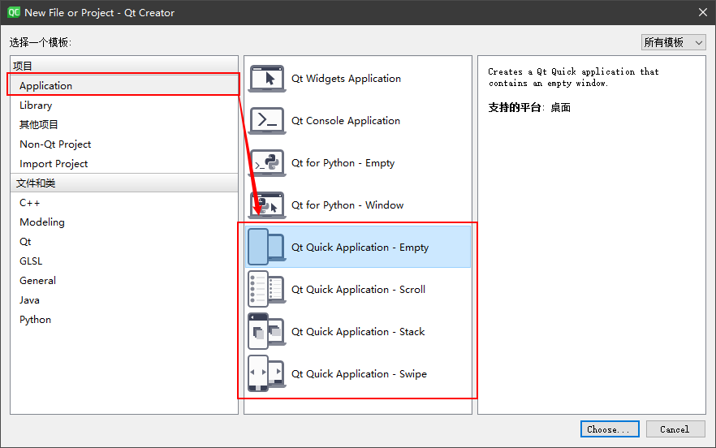
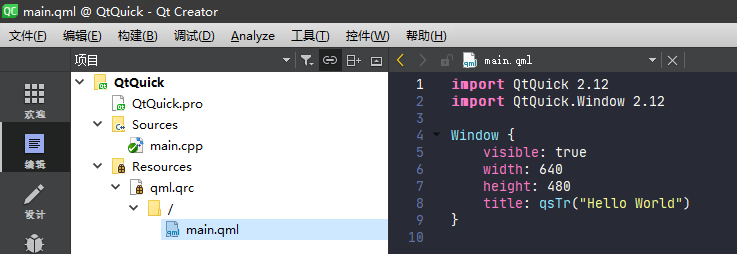
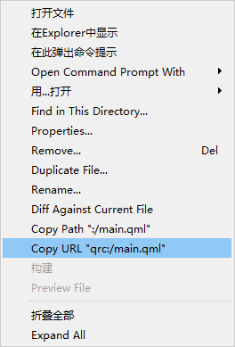
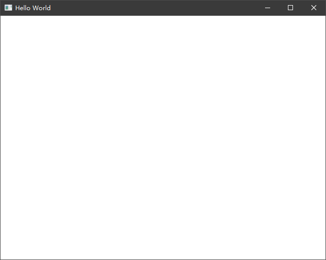

# What's Qt Quick

Qt Quick 与 Qt Widgets 属于同级事物，但使用方式有明显差异，Qt Widgets 更像 MFC，他使用 C++ 实现所有 UI 的展示，而 Qt Quick 使用 QML 描述所有 UI 的展示效果。三者均可以通过设计器进行布局、控件的拖拽安置，只不过设计器略有不同。

## 通过导航创建一个 Qt Quick 工程

打开 Qt Creator，点击左上角文件->新建文件或项目，选择 Application 菜单即可根据需要选择要创建的 Qt Quick 项目。



以一个 Qt Quick Application - Empty 工程为例，我们查看一下其目录结构。



像常规 C++ 项目一样，会生成一个 main.cpp 的入口文件，这个文件里面的内容同样包含了 main 函数入口，如下所示：

```C++
#include <QGuiApplication>
#include <QQmlApplicationEngine>

int main(int argc, char *argv[])
{
    QCoreApplication::setAttribute(Qt::AA_EnableHighDpiScaling);

    QGuiApplication app(argc, argv);

    QQmlApplicationEngine engine;
    const QUrl url(QStringLiteral("qrc:/main.qml"));
    QObject::connect(&engine, &QQmlApplicationEngine::objectCreated,
                     &app, [url](QObject *obj, const QUrl &objUrl) {
        if (!obj && url == objUrl)
            QCoreApplication::exit(-1);
    }, Qt::QueuedConnection);
    engine.load(url);

    return app.exec();
}
```

与传统 Qt Widgets 不同的是，这里并不是创建一个 Widget Window，而是使用 QQmlApplicationEngine 对象加载了一个 `main.qml` 的 UI 资源描述文件。这个 `main.qml` 文件就是上面图中我们看到的使用 QML 语法描述的窗口信息。

```QML
import QtQuick 2.12
import QtQuick.Window 2.12

Window {
    visible: true
    width: 640
    height: 480
    title: qsTr("Hello World")
}
```

这个文件被放到了 qrc 资源文件中的根目录，所以使用 `qrc:/main.qml` 就可以索引到该文件。想快速获得该文件的路径，可以在该文件上点右键复制 URL 地址：



运行该项目后，你就可以看到一个宽度为 640、高度为 480、窗口名称为 Hello world 的窗口，这就是最简单的一个 Qt Quick 构建的窗口。



这个窗口全部使用 QML 语言来进行描述，而 QML 语言又是什么，它的编写规则又是如何，请参考 [QML](QML.md)
