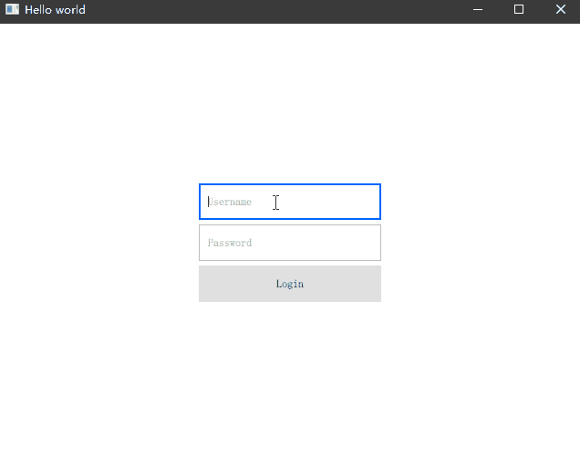

# Loader

到目前为止，我们一直在使用声明式方式来加载一个组件，当有些组件需要被动态替换时声明式的方式就无法满足我们的需求了，Loader 可以帮忙我们解决这个问题。它可以动态的从文件或者内联组件中加载一个子项。这在一些单页面应用中非常实用，它类似一些前端框架的单页面应用中根据不同 router 改变不同页面的行为。严格意义上讲，他并不算是一种容器，但是它可以具备一种容纳组件的能力。

## 加载一个组件

```QML
import QtQuick 2.12
import QtQuick.Window 2.12
import QtQuick.Controls 2.12
import QtQuick.Layouts 1.12

Window {
    visible: true
    width: 640
    height: 480
    title: qsTr('ListView example')
    MouseArea {
        anchors.fill: parent
        onClicked: componentLoader.sourceComponent = newComponent
    }

    Loader {
        id: componentLoader
        anchors.fill: parent
    }
    Component {
        id: newComponent
        Item {
            anchors.fill: parent
            Label {
                anchors.centerIn: parent
                font.pixelSize: 24
                text: 'New Page'
            }
        }
    }
}
```

上面的示例代码中，我们创建了一个 Loader 和 MouseArea 区域充满整个窗口，当我们点击窗口任意位置的时候，Loader 会加载 `newComponent`，newComponent 中包含了一个简单的 Label 展示了一行文字。演示效果如下：


## 从文件加载不同组件

上面的例子非常简单，但是它并没有什么实质性作用，我们通过一个真是项目中可能会使用到的场景来讲述 Loader 的作用。

一些传统应用中，登录页面和实际运行时页面可能是不同的两个窗口，而如果使用 Qt Quick 来设计时，你可能会将他们设计为一个单页面的应用，就是登录和运行时都使用同一个窗口宿主，只不过在登录前我们展示登录页面，登录后我们展示实际的应用能力页面。为了演示这个功能，我们分别创建两个自定义页面，通过 Loader 来演示如何动态切换它们。

 - LoginPage 负责展示登录页的内容
 - MainPage 负责展示实际应用中的内容

```QML
// LoginPage.qml
import QtQuick 2.0
import QtQuick.Controls 2.12
import QtQuick.Layouts 1.12

Item {
    anchors.fill: parent

    ColumnLayout {
        anchors.centerIn: parent

        TextField {
            Layout.fillWidth: true
            placeholderText: 'Username'
        }

        TextField {
            Layout.fillWidth: true
            placeholderText: 'Password'
        }

        Button {
            Layout.fillWidth: true
            text: 'Login'
            onClicked: pageLoader.setSource(Qt.resolvedUrl('qrc:/MainPage.qml'))
        }
    }
}
```

```QML
// MainPage.qml
import QtQuick 2.0
import QtQuick.Controls 2.12

Item {
    anchors.fill: parent
    Label {
        anchors.centerIn: parent
        font.pixelSize: 30
        text: 'Welcome my app'
    }
}
```

在 main.qml 中，同样我们使用一个 Loader 充满整个父容器，并且在 Window 加载完成时，我们让 Loader 默认加载 LoginPage.qml 页面：

```QML
import QtQuick 2.12
import QtQuick.Window 2.12
import QtQuick.Controls 2.12
import QtQuick.Layouts 1.12

Window {
    visible: true
    width: 640
    height: 480
    title: qsTr('Hello world')

    Component.onCompleted: {
        // 默认加载 Login 页面
        pageLoader.setSource(Qt.resolvedUrl('qrc:/LoginPage.qml'))
    }

    Loader {
        id: pageLoader
        anchors.fill: parent
    }
}
```

此时运行程序，LoginPage 会映入我们眼帘，当我们点击了 Login 按钮后（这里没有做任何校验，主要为了演示 Loader 功能），我们通过 Loader 的 setSource 接口设置了新的组件。演示效果如下：



当我们加载了 MainPage.qml 后，LoginPage 还存在吗？这是一个很好的问题，为了验证 LoginPage 是否存在，我们可以关注组件的 onDestruction 事件来判断加载新的组件后之前的组件是不是被销毁掉了。

```QML
import QtQuick 2.0
import QtQuick.Controls 2.12
import QtQuick.Layouts 1.12

Item {
    anchors.fill: parent

    Component.onDestruction: {
        console.log('Login page destructed.')
    }

    // .... 
}
```

当我们运行程序并点击 Login 按钮后，可以看到控制台打印了 `qml: Login page destructed.`，表示 LoginPage 已经销毁掉了。所以我们不需要太操心内存管理的问题，Loader 已经全权处理了。

