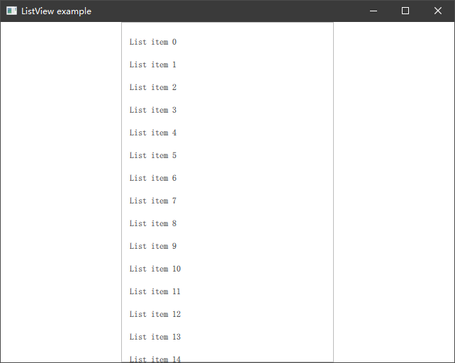
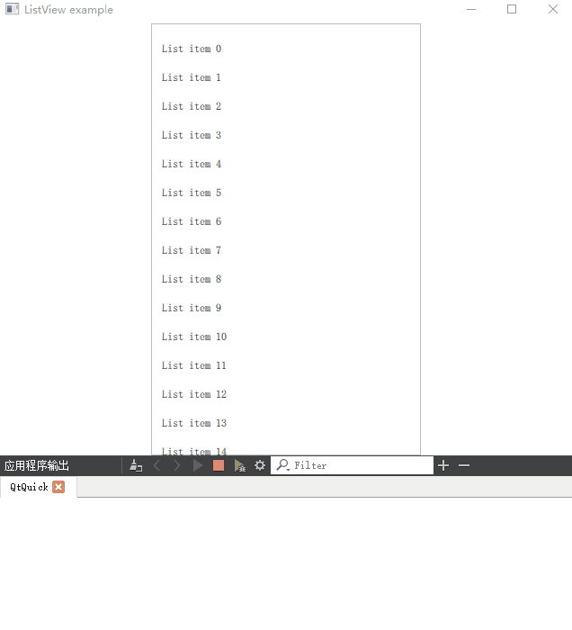

# Views

除了一些固定视觉资源的展示外，很多情况下我们还是要通过列表或其他方式来展示一组数据，比如一个成员列表等。Qt Quick 为我们提供了一些视图组件如 ListView、GridView 等，通过它们可以轻松的展示一组指定格式的数据。我们以 ListView 为例描述如何在 Qt Quick 中使用它们。

## 数据、视图、委托

Qt Quick 的视图将显示和数据分离，数据使用 Model 描述，而 ListView 仅仅是一个容器，至于数据如何显示则依赖 Delegate 委托。以下是三者不同的关系：

 - Model 数据模型 - 包含有指定格式的数据，QML 提供了部分类型提供快速创建一个 Model
 - View 视图 - 用于显示数据的容器，如 ListView、GridView 等
 - Delegate 委托 - 描述了数据如何在 View 中展示，可以通过委托访问数据同时也可以通过委托来修改模型中的数据

其中数据的流向 Qt 官方文档中给出了这样一幅图：


数据的变动会让 View 进行重绘，重绘过程中 View 会根据 Delegate 给出的样式进行绘制，委托中可以直接访问模型中的数据用来展示不同的数据内容。下面通过一个简单的示例来描述他们是如何工作的。

## 展示一组数据

我们在窗口中放置一个 ListView，让它在 Frame 中主要是为了显示一个边框使我们可以清楚的看到 ListView 所在窗口的区域。

```QML
import QtQuick 2.12
import QtQuick.Window 2.12
import QtQuick.Controls 2.12

Window {
    visible: true
    width: 640
    height: 480
    title: qsTr('ListView example')
    Frame {
        width: 300
        height: parent.height
        anchors.centerIn: parent
        ListView {                  // 用于显示数据的 view
            anchors.fill: parent
            model: ListModel {      // 用于插入数据的 model
                id: listModel
            }
            delegate: ItemDelegate {// 用于描述数据如何展示的 delegate
                height: 32
                width: parent.width
                Label {
                    anchors.verticalCenter: parent.verticalCenter
                    anchors.leftMargin: 10
                    text: qsTr('List item %1').arg(model.index) // 使用模型中的数据显示在 item 中
                }
                onClicked: {
                    console.log('Clicked item: ', model.index)
                }
            }
            Component.onCompleted: {
                // ListView 加载完成时，在 listModel 中插入 100 条数据
                for (let i = 0; i < 100; i++) {
                    listModel.append({ index: i })
                }
            }
        }
    }
}
```

ListView 中我们指定了一个 ListModel 分配给 model 属性，指定了一个 ItemDelegate 分配给 delegate 属性。

在 ListView 加载完毕后（Component.onCompleted）我们使用 listModel 对象给模型插入了 100 条数据。

在 ItemDelegate 中我们设置了一下每个 Item 的宽高，并放置了一个 Label 用于显示模型中的数据。最终效果如下：



使用鼠标滚轮滚动或者鼠标拖拽都可以滚动 ListView 来查看下面的数据，如果你的程序运行在一个可触控的设备上，你可以通过触控滑动来查看列表中的数据。

ItemDelegate 是一个 QML 自带的类型，实现了一些简单的 ListItem 该有的能力比如点击后背景变色高亮等。你可以使用任何其他可视化组件替代它，比如 Rectangle 等。

在 ItemDelegate 中我们添加了其 clicked 信号的处理程序，用于在点击某个 Item 的时候做出响应，当我们点击不同的 Item 时会在控制台打印不同 Item 的索引。如下所示：

```
qml: Clicked item:  7
qml: Clicked item:  8
qml: Clicked item:  9
qml: Clicked item:  10
```

## 独立 Delegate 组件

有时 ListView 中的每一个子项可能包含很多能力，比如展示一组数据、对单独的数据做删改等操作，这时 Delegate 的样式代码可能会比较多，都放在 ListView 中去编写会导致代码结构可读性很差。你可以将 Delegate 要展示的样式单独使用一个文件来描述，ListView 当做组件将其引入，上面示例中，我们将 ItemDelegate 单独为一个 ListItem.qml 文件，并增加了一些功能。如下所示：

```QML
// ListItem.qml
import QtQuick 2.0
import QtQuick.Controls 2.12
import QtQuick.Layouts 1.12

ItemDelegate {// 用于描述数据如何展示的 delegate
    RowLayout {
        width: parent.width
        anchors.verticalCenter: parent.verticalCenter
        Label {
            Layout.alignment: Qt.AlignVCenter
            text: qsTr('List item %1').arg(model.index) // 使用模型中的数据显示在 item 中
        }
        Button {
            id: btnGetIndex
            Layout.preferredHeight: 20
            Layout.preferredWidth: 60
            Layout.alignment: Qt.AlignRight | Qt.AlignVCenter
            visible: false
            text: qsTr('Index')
            onClicked: console.log('Clicked item: ', model.index)
        }
    }
    onHoveredChanged: {
        btnGetIndex.visible = hovered
    }
}
```

在 ListView 中，你可以直接引入这个组件作为他的委托（请保证文件在同一目录，否则你需要使用 import 语句引入指定组件）

```QML
import QtQuick 2.12
import QtQuick.Window 2.12
import QtQuick.Controls 2.12
import QtQuick.Layouts 1.12

Window {
    visible: true
    width: 640
    height: 480
    title: qsTr('ListView example')
    Frame {
        width: 300
        height: parent.height
        anchors.centerIn: parent
        ListView {
            anchors.fill: parent
            model: ListModel {
                id: listModel
            }
            delegate: ListItem {    // 使用自定义的 ListItem
                height: 32
                width: parent.width
            }
            Component.onCompleted: {
                for (let i = 0; i < 100; i++) {
                    listModel.append({ index: i })
                }
            }
        }
    }
}
```

我们在 ListItem.qml 中描述的委托增加了获取当前索引的按钮，并让鼠标悬浮时显示该按钮、鼠标移开时隐藏。当点击里面的按钮时我们打印一下当前 Item 的索引，演示效果如下：



## 总结

传统的一组数据展示通过上面的方法已经基本上满足需求，谨记 Model、View、Delegate 之间的关系会让你自如的使用它们。通过上面的示例中我们不难看出，数据是前端驱动的，但往往一些数据是通过后端 C++ 层来输出的，该如何将 C++ 中的数据传递到前端来使用将是我们后面要介绍的内容。
