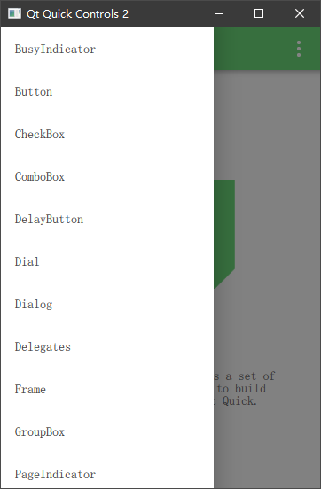
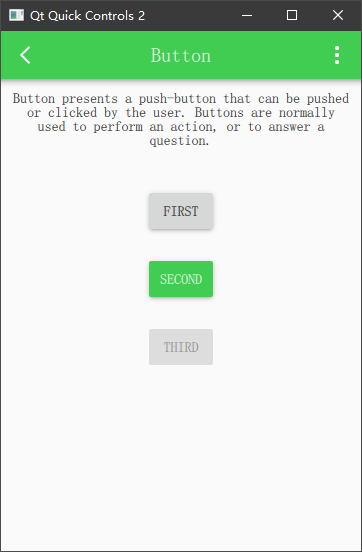
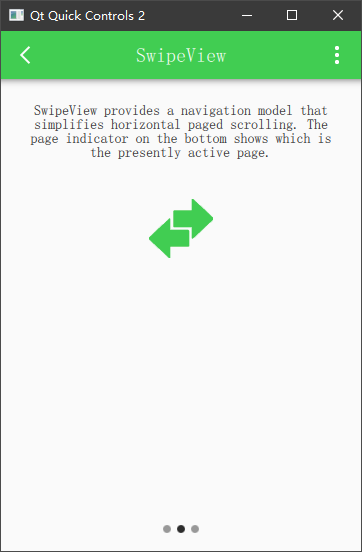

## Qt Quick Controls

Qt Quick Controls 是目前来看提供的基础控件能力最完整的集合。它不像一些 React、Vue 这种前端 UI 框架仅仅提供基础能力，而由外部团队去完成交互控件的设计和实现（如 Ant Design 等类似视觉交互语言）而是将一些常用的基础交互能力的控件全部抽象出来提供开发者使用。

当我们使用 Duilib 或者 MFC 等类似 UI 框架时，如果需要实现一个 Loading 状态的图标，我们需要自己组织图片、使用基础控件能力去加载一个 gif 图像来实现类似功能。而 Qt Quick Controls 则直接提供了一个 `BusyIndicator Control` 提供开发者快速引入到项目中，并且它的样式你是可以高度自定义的。如下所示：


在 Qt 官方文档中，他们对 Qt Quick Controls 做了如下分类。

| 控件类型 | 说明 |
| -- |-- |
| Button Controls | 按钮类型控件，Button、CheckBox、Switch 等 |
| Container Controls | 容器类控件，Frame、ScrollView、TabBar 等 |
| Delegate Controls | 委托类控件，ItemDelegate、CheckDelegate 等 |
| Indicator Controls | 指示器类控件，BusyIndicator、ProgressBar 等 |
| Input Controls | 输入类控件，TextField、ComboBox、Slider 等 |
| Menu Controls | 菜单类控件，Menu、MenuItem、MenuBar 等 |
| Navigation Controls | 导航类控件，Drawer、TabButton 等 |
| Popup Controls | 弹出类控件，Dialog、Popup、Tooltip 等 |
| Separator Controls | 分隔符控件，MenuSeparator、ToolSeparator |

在 Qt 的安装目录下的 Examples 文件夹中，有一个名为 `gallery` 的工程，工程演示了几乎所有控件的使用示例：









## 控件的事件响应

控件的存在既是为了人机交互，每当我们点下一个按钮、滑动一个页面、拖动一个进度条时，都会产生对应的事件，处理这些事件可以达到我们交互的需求。以按钮的点击事件为例，当我们点击一个按钮时，我们在控制台打印一些内容：

```QML
import QtQuick 2.12
import QtQuick.Window 2.12
import QtQuick.Controls 2.12

Window {
    visible: true
    width: 640
    height: 480
    title: qsTr('Hello world')

    Button {
        anchors.centerIn: parent
        text: 'Click me'
        onClicked: {
            console.log('Button clikced.')
        }
    }
}
```

上面代码中，我们响应了按钮的点击事件，实际该按钮有一个 clicked 信号，当我们点击后触发该信号的处理程序 onClicked，随后在控制台打印了 `Button clikced.`

同样的，再举一个 Slider 的例子，Slider 是一个滑动条，当我们拖动滑动块的时候，会触发 Slider 的 valueChanged 信号，我们只需要响应这个信号即可观测到数据的变化

```QML
Slider {
    onValueChanged: {
        console.log('Slider values changed: ', value)
    }
}
```

拖动滑动条后控制台打印：

```
qml: Slider values changed:  0.14375
qml: Slider values changed:  0.20625
qml: Slider values changed:  0.225
qml: Slider values changed:  0.525
qml: Slider values changed:  0.7875
```

## 基础数据变更响应

在前文提到的 QML 基础中，我们了解到几乎所有控件都是派生于 Item，Item 有一些公共的属性，比如 visible、enabled、focus、height、width、x、y 等属性，我们同样可以检测这些属性的变更来做不同的事情，比如我们在点击按钮后将按钮禁用，通过 onEnabledChanged 事件即可检测到这一变更。

```QML
Button {
    text: 'Click me'
    onClicked: {
        console.log('Button clikced.')
        enabled = false
    }
    onEnabledChanged: {
        console.log('Button enabled changed, enabled: ', enabled)
    }
}
```

示例中我们点击按钮后打印一句话并将按钮的 enabled 属性设置为 false，同时我们响应了 enabledChanged 信号，打印了 enabled 属性变更的通知，控制台将打印如下内容：

```
qml: Button clikced.
qml: Button enabled changed, enabled:  false
```

同理其他基础属性一样可以通过这种方式来处理。除了在控件内部直接 on* 的方式响应属性变更，我们同样可以在外部使用 Connections 来连接这些信号：

```QML
Button {
    id: btn1
    text: 'Click me'
    onClicked: {
        console.log('Button clikced.')
        enabled = false
    }
}

Connections {
    target: btn1
    onEnabledChanged: {
        console.log('Button enabled changed, enabled: ', enabled)
    }
}
```

我们使用 Connections 连接了 btn1 的 enabledChanged 信号，这个效果是一样的。

## 总结

Qt Quick Controls 种类繁多，Qt 文档中有非常详细的说明，我们可能无法一一列举这些控件的使用方式，但是通过文档可以快速了解这些控件都具有哪些能力、哪些属性供我们实现需求。在后面的更新中，除了一些特殊控件的使用我们会再补充一些外，对于控件的基础使用可能不会再过多的赘述，把它用到你的项目中，可能你的理解会更加深刻。
