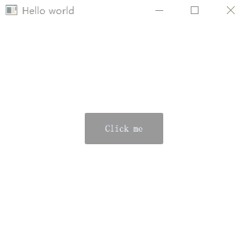
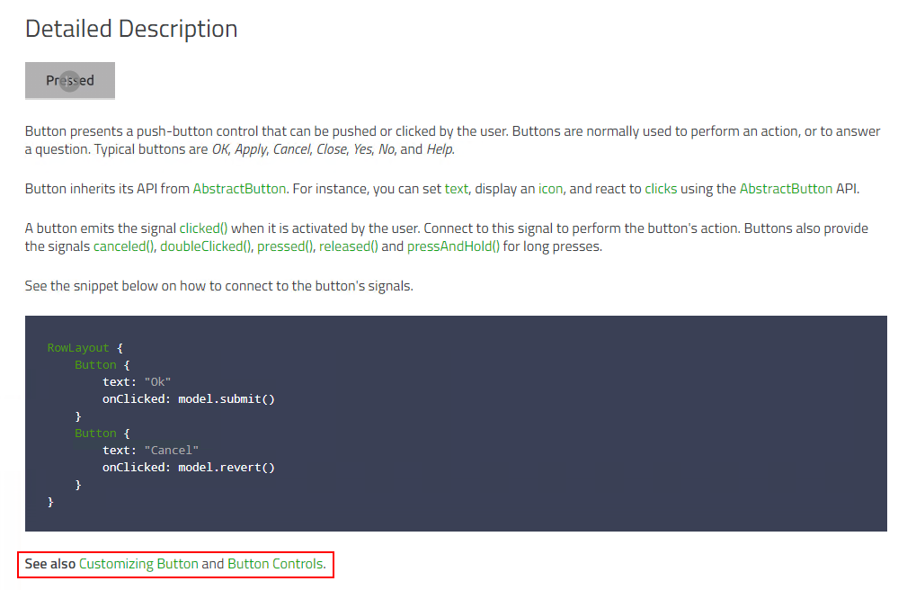
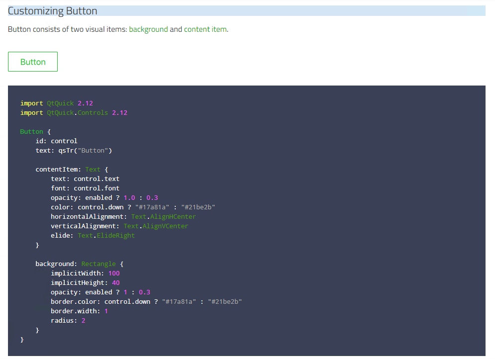

# Customizing Qt Quick Controls（自定义控件样式）

虽然 Qt Quick 提供的基础控件已经非常丰富，但是往往我们开发的项目中需要对不同的控件做定制，比如我们希望按钮的背景不是灰色而是黑色，控件的默认文本颜色不是黑色而是白色。那么就需要通过自定义控件样式来实现了。以 Button 为例：

```QML
Button {
    id: control
    text: 'Click me'
    contentItem: Text {
        text: control.text
        font: control.font
        opacity: enabled ? 1.0 : 0.3
        color: control.down ? "#CCCCCC" : "#FFFFFF" // 按钮按下文字为 #cccccc，普通状态为 #ffffff
        horizontalAlignment: Text.AlignHCenter
        verticalAlignment: Text.AlignVCenter
        elide: Text.ElideRight
    }
    
    background: Rectangle {
        implicitWidth: 100
        implicitHeight: 40
        opacity: enabled ? 1 : 0.3
        color: control.down ? '#333333' : '#999999' // 按钮按下背景色为 #333333，普通状态为 #999999
        radius: 2
    }
}
```

通过 contentItem 和 background 属性，我们定制了按钮按下时文字颜色的不同和背景颜色的不同，效果如下：



这是 Qt Quick Controls 2 系列控件的通用定制方案，通过 Qt Quick Controls 对每一个控件描述的文档中，你可以很方便的找到自定义控件样式的链接：



访问 Customizing* 的链接，便可以找到对应的自定义样式链接，里面包含了一些简单的示例足以让你来个性化自己的控件样式：


