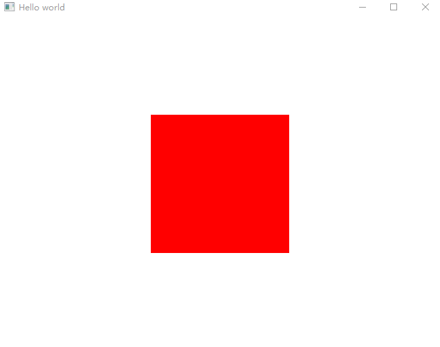
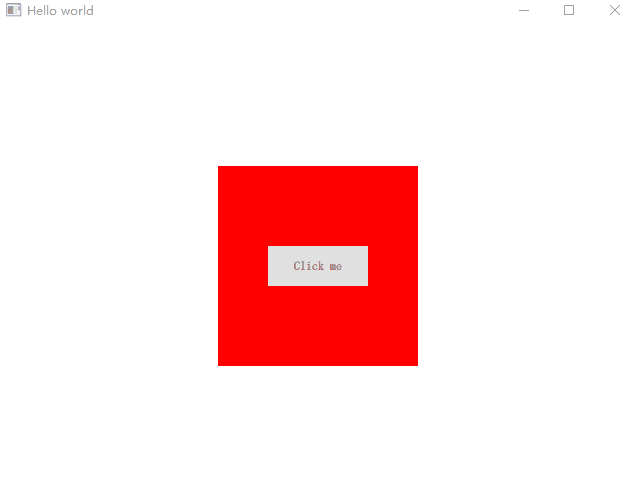

# Handlers

QML 中有一些特殊的对象类型（严格意义来讲他们并不属于控件类型，当我们有更好的分类时可能移动这部分到其他位置。）他们是不可见的，用于提供一些点击、触控等事件，当我们需要处理一些鼠标或者触控事件时，可能会用到他们。

## MouseArea

前面的文章中我们不止一次看到过这个 QML 对象类型，它在 QML 中是一个不可见对象，提供鼠标的一些简单的事件处理，比如鼠标进入、鼠标离开、鼠标按下、鼠标弹起、鼠标移动等。以下是一个 MouseArea 的示例：

```QML
import QtQuick 2.12
import QtQuick.Window 2.12
import QtQuick.Controls 2.12

Window {
    visible: true
    width: 640
    height: 480
    title: qsTr('Hello world')
    
    Rectangle {
        width: 200
        height: 200
        color: 'red' // default color
        anchors.centerIn: parent

        MouseArea {
            anchors.fill: parent
            hoverEnabled: true
            onEntered: {
                parent.color = 'green'  // 鼠标进入
            }
            onExited: {
                parent.color = 'red'    // 鼠标离开
            }
            onPressed: {
                parent.color = 'gray'   // 鼠标按下
            }
            onReleased: {               // 鼠标弹起
                if (containsMouse) {    // 判断鼠标是否在当前区域内
                    parent.color = 'green'
                } else {
                    parent.color = 'red'
                }
            }
            onClicked: {                // 鼠标点击 pressed + released
                console.log('Mouse area clicked.')
            }
        }
    }
}
```



它经常用于对一些自定义的控件如图片控件、某些非常规的控件要响应鼠标事件时使用，但 MouseArea 有一点不好的是，他需要依附在一个项目中，上面的例子就是在 Rectangle 里面的，让 Rectangle 具有鼠标事件的处理能力，我们需要控制他铺满整个 Rectangle 才能响应对应的事件，而且一旦我们开启了 `hoverEnabled` 属性，在它之前创建的一些控件就无法响应鼠标事件了，有时我们仅需响应鼠标的进入、离开，但又不想影响该区域内其他控件的事件响应，该如何实现呢？

## HoverHandler

Qt 5.14.1 版本引入了另外一个事件处理程序 `HoverHandler`，他可以完美的实现我们的需求。先来看一个例子

```QML
import QtQuick 2.12
import QtQuick.Window 2.12
import QtQuick.Controls 2.12

Window {
    visible: true
    width: 640
    height: 480
    title: qsTr('Hello world')
    
    Rectangle {
        width: 200
        height: 200
        color: 'red' // default color
        anchors.centerIn: parent

        Button {
            text: 'Click me'
            anchors.centerIn: parent
            onClicked: console.log('Button clicked')
        }

        HoverHandler {
            onHoveredChanged: {
                if (hovered) {
                    parent.color = 'green'
                } else {
                    parent.color = 'red'
                }
            }
        }
    }
}
```

我们使用 HoverHandler 替换了 MouseArea，它不具有鼠标点击事件的处理能力，但是通过监听 hoveredChanged 信号同样可以捕获鼠标的悬停、离开等事件。并且它不会影响内部其他控件的事件流，如下图所示：



HoverHandler 以父容器为基准，不需要我们单独在使用 anchors.fill: parent 来告诉它要填充哪个区域。而且它还可以在不同的设备如带有鼠标和触控设备上都能很好的工作。HoverHandler 非常实用，我们可以用它来实现一个菜单的隐藏显示、工具条的隐藏显示等功能而不会影响界面中的其他 UI 元素。

同样的除了 HoverHandler 以外，Qt 还引入了其他的类似事件处理对象如 `PointHandler`、`TapHandler`、`WheelHandler`。
