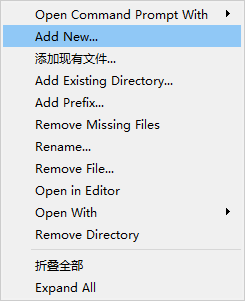
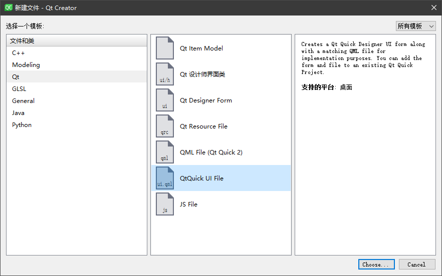
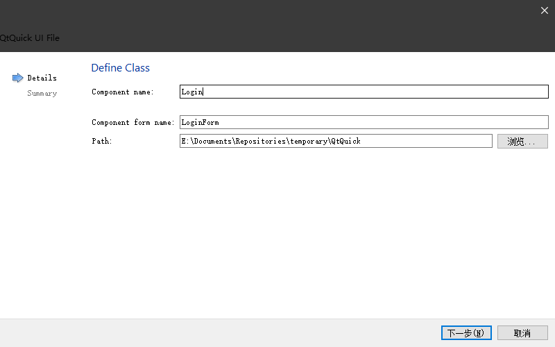
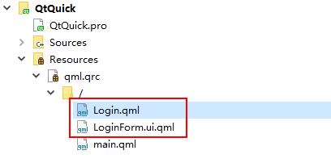
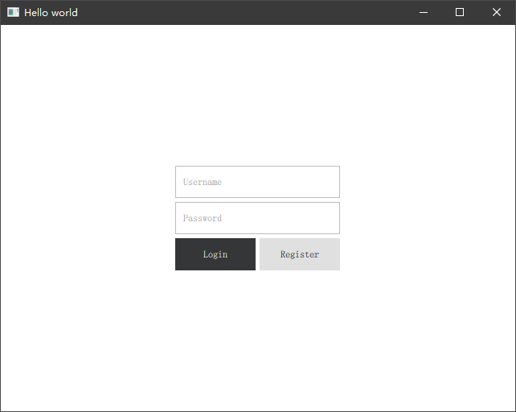
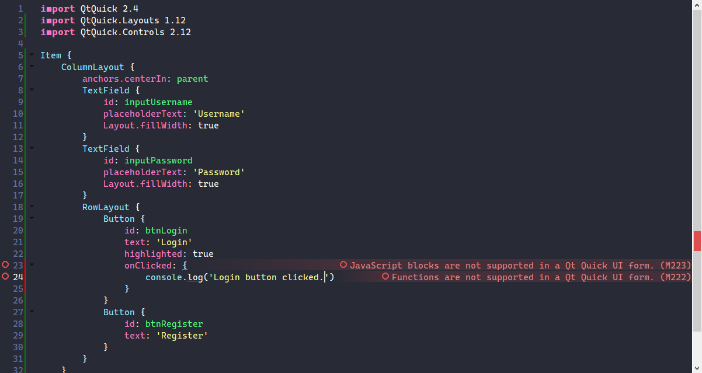

# UI Forms

在使用 Qt Quick 制作界面的过程中，我们往往都是通过一个单独的文件来描述一个 UI 元素或者一个窗口样式。你会发现我们一些事件处理程序（逻辑）和视觉展示元素（UI）高度耦合在一起，某些情况下会造成单一的文件代码逻辑庞大，影响整体的代码可读性。为此 Qt Quick 提出了一种 UI 和逻辑分离的概念。下面我们做一个演示。

## 创建一个 UI Form

在项目的 .qrc 文件上点击右键，添加新文件：



在弹出的对话框中选择 Qt Quick UI File



在随后的对话框中输入我们要创建的 UI Form 的名称，这里命名为 Login



可以看到在，导航框中出现两个 name 输入框，一个是 Component name，一个是 Component form name。我们只需要输入 Comopnent name 后 Component form name 会自动生成。创建完成后会生成两个文件：



其中 LoginForm.ui.qml 是专门用来描述 UI 资源的文件，而 Login.qml 则是我们要在其他位置引入的组件，Qt Quick 会自动帮我们将两个文件进行关联。接下来我们在 main.qml 中引入我们的 Login 组件并让他填充整个父节点（Window）。

```QML
import QtQuick 2.12
import QtQuick.Window 2.12
import QtQuick.Controls 2.12

Window {
    visible: true
    width: 640
    height: 480
    title: qsTr('Hello world')

    Login {
        anchors.fill: parent
    }
}
```

打开 LoginForm.ui.qml 文件，我们修改一下里面的内容，将默认的宽高度去掉（由外部指定），然后像布局一节中介绍到的制作一个登录窗口：

```QML
import QtQuick 2.4
import QtQuick.Layouts 1.12
import QtQuick.Controls 2.12

Item {
    ColumnLayout {
        anchors.centerIn: parent
        TextField {
            id: inputUsername
            placeholderText: 'Username'
            Layout.fillWidth: true
        }
        TextField {
            id: inputPassword
            placeholderText: 'Password'
            Layout.fillWidth: true
        }
        RowLayout {
            Button {
                id: btnLogin
                text: 'Login'
                highlighted: true
            }
            Button {
                id: btnRegister
                text: 'Register'
            }
        }
    }
}
```

修改完成后运行效果如下：



我们没有做任何控件的信号处理程序，界面仅仅展示部分内容，可以看到只要在 LoginForm.ui.qml 文件中将所需的视觉资源添加到这里面就可以了。但是这里要注意，我们不能直接在 LoginForm.ui.qml 文件中添加事件处理程序，否则 IDE 会有错误提示，如下所示：



IDE 告诉我们，Qt Quick UI form 中不支持 JavaScript 函数，虽然这样提示，但是实际我们运行项目后点击 Login 按钮也是一样可以响应这些信号的，其实就是 IDE 层显示的告诉我们“不要这样做！”

那怎样的做法才是正确的呢？首先我们要把所有控件对象的 id 导出让外部可以访问，像下面这样。

```QML
import QtQuick 2.4
import QtQuick.Layouts 1.12
import QtQuick.Controls 2.12

Item {
    // 导出所有控件，告诉外部该控件可以通过 inputUsername 这个名称来访问
    property alias inputUsername: inputUsername
    property alias inputPassword: inputPassword
    property alias btnLogin: btnLogin
    property alias btnRegister: btnRegister

    ColumnLayout {
        anchors.centerIn: parent
        TextField {
            id: inputUsername
            placeholderText: 'Username'
            Layout.fillWidth: true
        }
        TextField {
            id: inputPassword
            placeholderText: 'Password'
            Layout.fillWidth: true
        }
        RowLayout {
            Button {
                id: btnLogin
                text: 'Login'
                highlighted: true
            }
            Button {
                id: btnRegister
                text: 'Register'
            }
        }
    }
}
```

随后打开 Login.qml 文件，在这里添加具体的信号处理程序。

```QML
import QtQuick 2.4

LoginForm {
    btnLogin.onClicked: {
        const username = inputUsername.text
        const password = inputPassword.text
        // Login to your app server
        // app.Login(username, password)
        console.log('Login button, username: ', username, ', Password: ', password)
    }
    btnRegister.onClicked: {
        const username = inputUsername.text
        const password = inputPassword.text
        // Register a account from your app server
        // app.Register(username, password, password)
        console.log('Register button, username: ', username, ', Password: ', password)
    }
}
```

我们分别添加了两个按钮的 clicked 信号处理程序，当我们运行程序后随便输入一些信息，分别点击 Login 按钮和 Register 按钮时，控制台则会打印如下信息。

```
qml: Login button, username:  MyAccount , Password:  MyPassword
qml: Register button, username:  MyAccount , Password:  MyPassword
```

## 总结

以上就是一个最简单的 UI form 示例程序了。它将我们实际的 UI 展示元素和逻辑强制分离，其设计的目的其实是考虑一些团队协作的方式中 UI 的设计和逻辑开发可能并不是一个团队来完成的，UI 的设计可能是视觉人员来做的，但是在中国的一些互联网公司中，往往交互视觉并不是直接通过这些开发工具来完成的，而是一个统一的交互视觉平台来做这些事情，开发人员再根据交互视频的稿子制作出对应的 UI 界面。很明显工具好用但是水土不服，实际的开发过程中我曾不断尝试使用 UI Form 的方式来设计应用程序，但是会发现它带来的成本是大量的 alias 别名，并不会应为引入这样的方式带来任何便利，所以如果你的团队协作方式还是相对传统的，我还是推荐使用普通的 Qt Quick 文件来完成 UI 元素的设计。这里也希望国内一些互联网公司能加快脚步，赶上潮流。

