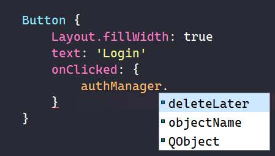
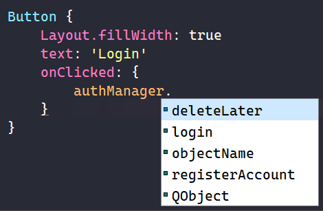
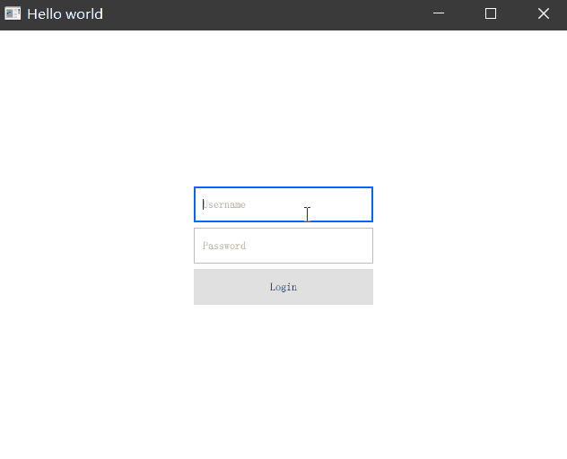

# Embedding C++ Objects into QML with Context Properties

在使用 Qt Quick 开发客户端程序时，我们以往固有的一些 C++ 类已经比较成熟，它可能具备一些调用第三方库的能力，或者去发送一个网络请求等。如何将他们注册到 QML 中使用就是我们比较关心的内容了。

## 注册 C++ 类到 QML 全局上下文

假设我们有一个已经创建好的类名为 AuthManager。其中包含了一些登录、注册等发送 HTTP 请求的相关能力。这些接口在发送一个异步 HTTP 请求后通过回调的方式告诉 C++ 这一层请求发送成功还是失败。代码如下：

```C++
#ifndef AUTHMANAGER_H
#define AUTHMANAGER_H

#include <QObject>

class AuthManager : public QObject
{
    Q_OBJECT
public:
    explicit AuthManager(QObject *parent = nullptr);
    void login(const QString& username, const QString& password) {
        // Send HTTP request
        // emit loginSignal(true or false)
    }
    void registerAccount(const QString& username, const QString& password) {
        // Send HTTP request
        // emit registerSignal(true or false)
    }

signals:
    void loginSignal(bool success);
    void registerSignal(bool success);
    
private:
    bool m_loggedIn = false;
};

#endif // AUTHMANAGER_H
```

这个类继承了 QObject，包含了两个方法，一个是 login、一个是 registerAccount，并且该类有一个成员变量 m_loggedIn 用来判断是否已经是登录状态，默认该值为 false。

要把这个类实例化的对象注册给前端使用，首先要先实例化一个对象，然后通过 QML 引擎的 setContextProperty 接口将其嵌入到 QML 的全局上下文中，main.cpp 的代码如下：

```C++
#include <QGuiApplication>
#include <QQmlApplicationEngine>

#include <QQmlContext>      // 引入 QQmlContext
#include "auth_manager.h"   // 引入 AuthManager

int main(int argc, char *argv[])
{
    QCoreApplication::setAttribute(Qt::AA_EnableHighDpiScaling);

    QGuiApplication app(argc, argv);

    QQmlApplicationEngine engine;

    // 实例化 AuthManager 对象
    AuthManager authManager;
    // 注入到 QML 引擎的全局上下文中，命名为 authManager
    engine.rootContext()->setContextProperty("authManager", &authManager);

    const QUrl url(QStringLiteral("qrc:/main.qml"));
    QObject::connect(&engine, &QQmlApplicationEngine::objectCreated,
                     &app, [url](QObject *obj, const QUrl &objUrl) {
        if (!obj && url == objUrl)
            QCoreApplication::exit(-1);
    }, Qt::QueuedConnection);
    engine.load(url);

    return app.exec();
}
```

注册成功后，我们就可以在 QML 中访问 authManager 了，在前面写好的 Login 界面中，我们响应 Login 按钮的点击事件，看看能否调用 authManager 中的一些方法：



可以看到 authManager 这个关键字已经高亮了，但是我们无法访问它任何方法或者属性。其实直接将一个纯 C++ 类注册给 QML 使用，是无法在前端使用它所有功能的，我们需要将要暴露给前端的方法声明为一个 QML 可调用的函数。

## Q_INVKEALBE 声明函数可被调用

在 login 和 registerAccount 方法前，我们使用 Q_INVOKABLE 宏来修饰这两个函数允许被前端调用，类似如下代码：

```C++
Q_INVOKABLE void login(const QString& username, const QString& password) {
    // Send HTTP request
    // emit loginSignal(true or false)
}
Q_INVOKABLE void registerAccount(const QString& username, const QString& password) {
    // Send HTTP request
    // emit registerSignal(true or false)
}
```

请注意方法前的 Q_INVOKABLE 宏是在函数返回值之前的。再次到前端尝试调用这两个方法：



可以看到，authManager 中多出了 login 和 registerAccount 方法来提供我们调用。尝试调用一下 login 方法并传递我们在界面中输入的用户名和密码，在 C++ 的 login 方法中，我们打印一下这两个参数：

```QML
// in QML
Button {
    Layout.fillWidth: true
    text: 'Login'
    onClicked: {
        authManager.login(inputUsername.text, inputPassword.text)
    }
}
```

```C++
Q_INVOKABLE void login(const QString& username, const QString& password) {
    // Send HTTP request
    // emit loginSignal(true or false)
    qInfo() << "Received login request, username: " << username << ", password: " << password;
}
```

运行程序后随便输入一些内容然后点击 Login 按钮，效果如下：


控制台打印出了我们 UI 上输入的用户名和密码，这样一个简单的 QML 调用 C++ 方法的流程就打通了。

## Q_PROPERTY 声明属性供 QML 访问

除了调用一些方法外，我们可能还需要访问 C++ 类中的一些成员，要访问这些成员可以通过 Q_PROPERTY 宏来表示哪些成员是可以被访问的，比如我们希望 QML 允许访问成员变量 m_loggedIn。

首先创建一个该变量变更的通知信号：

```C++
signals：
    // ... 其他信号
    void loggedInChanged();
```

然后创建对该变量的读写函数，在写函数中修改了 m_loggedIn 变量后我们发送一个 loggedInChanged 信号通知观察者这个变量有变更了。

```C++
bool loggedIn() const {
    return m_loggedIn;
}
void setLoggedIn(bool value) {
    m_loggedIn = value;
    emit loggedInChanged();
}
```

最后我们通过 Q_PROPERTY 宏来告诉 QML，要访问这个变量你需要调用的各个函数。

```C++
Q_PROPERTY(bool loggedIn READ loggedIn WRITE setLoggedIn NOTIFY loggedInChanged)
```

Q_PROPERTY 一共有4个值

 - 第一个是告诉 QML 你要访问的这个属性的类型和名称
 - 第二个以 READ 开头表示要读取该属性你要调用的方法（我们已经创建好）
 - 第三个以 WRITE 开头表示要修改该属性你要调用的方法（同样已经创建好）
 - 第四个以 NOTIFY 开头表示这个属性变更时要关注的通知是哪一个（我们创建好的 loggedInChanged 信号）

请注意，Q_PROPERTY 并不是一个函数，而是一个宏，中间是不需要加逗号分割的。完整的 C++ 代码如下：

```C++
#ifndef AUTHMANAGER_H
#define AUTHMANAGER_H

#include <QObject>
#include <QDebug>

class AuthManager : public QObject
{
    Q_OBJECT
public:
    explicit AuthManager(QObject *parent = nullptr);

    Q_PROPERTY(bool loggedIn READ loggedIn WRITE setLoggedIn NOTIFY loggedInChanged)

    Q_INVOKABLE void login(const QString& username, const QString& password) {
        // Send HTTP request
        // emit loginSignal(true or false)
        qInfo() << "Received login request, username: " << username << ", password: " << password;
    }
    Q_INVOKABLE void registerAccount(const QString& username, const QString& password) {
        // Send HTTP request
        // emit registerSignal(true or false)
    }

    bool loggedIn() const {
        return m_loggedIn;
    }
    void setLoggedIn(bool value) {
        m_loggedIn = value;
        emit loggedInChanged();
    }

signals:
    void loginSignal(bool success);
    void registerSignal(bool success);
    void loggedInChanged();

private:
    bool m_loggedIn = false;
};

#endif // AUTHMANAGER_H
```

接下来我们尝试在 QML 中添加一些代码，让 Login 按钮在 loggedIn 为 false 时才允许点击，为 true 的时候禁用该按钮

```QML
Button {
    Layout.fillWidth: true
    text: 'Login'
    enabled: !authManager.loggedIn // 为 true 时禁用该按钮
    onClicked: {
        authManager.login(inputUsername.text, inputPassword.text)
    }
}
```

在 C++ 的 login 接口中我们调用 setLoggedIn 将 m_loggedIn 设置为 true，设置完成后会发出信号 loggedInChanged。看看我们通过前端调用 login 接口后成员 m_loggedIn 的变化会引起哪些变化。

```C++
Q_INVOKABLE void login(const QString& username, const QString& password) {
    // Send HTTP request
    // emit loginSignal(true or false)
    qInfo() << "Received login request, username: " << username << ", password: " << password;
    setLoggedIn(true);
}
```

效果如下：



当我们点击 Login 按钮后调用了 login 方法，login 方法将 m_loggedIn 设置为 true 并发出信号 loggedInChanged，告诉 QML 该值变化，QML 会根据该值的变化动态修改按钮的状态为禁用。

## 在 QML 中添加 C++ 的信号处理程序

除了调用 C++ 的方法和访问自定义属性外，我们还可以在 QML 中添加一个信号处理程序来处理 C++ 层发出的信号。在 C++ login 方法中，我们添加一行发送 loginSignal 信号的代码：

```C++
Q_INVOKABLE void login(const QString& username, const QString& password) {
    // Send HTTP request
    qInfo() << "Received login request, username: " << username << ", password: " << password;
    setLoggedIn(true);
    emit loginSignal(true);
}
```

随后在 QML 中使用 Connections 来连接 authManager 的 loginSignal 信号并向控制台输出一条内容打印传给信号的参数。

```QML
Connections {
    target: authManager     // 设置目标为 authManager
    onLoginSignal: {
        console.log('Login signal, success: ', success)
    }
}
```

运行程序后，点击 Login 按钮，就可以在控制台看到输出了如下内容：

```
Received login request, username:  "abc" , password:  "def"
qml: Login signal, success:  true
```

首先是 C++ login 接口打印了我们输入的用户名密码，然后 login 方法发出了 loginSignal 信号，前端接收到这个信号后输入了信号传递的参数为 true。

## 总结

以上既是通过注入全局上下文的方式让 C++ 与 QML 建立通讯的方法，这种方式比较简单，一般我们会将某个业务功能的控制器注入到 QML 提供调用和访问属性。它在 QML 中全局都只有一份数据，而如果我们希望根据不同需求创建不同的 C++ 对象在前端使用，就需要注册自定义类型来实现了，这是我们接下来要介绍的内容。
