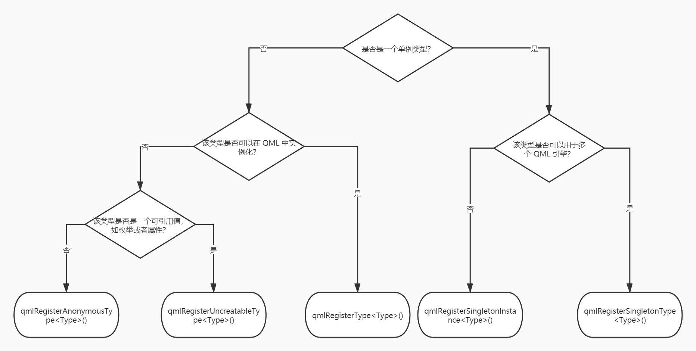

# Integrating QML and C++

Qt Quick 提供了多种 C++ 与 QML 交互的方法，不同的方法是根据你项目实际开发过程中的需求而决定的，总体思想是通过 C++ 创建一个基于 QObject 的子类并把这个子类通过 Qt 提供的不同的方法注册到 QML 中使用。在 QML 中可以实例化一个自定义 C++ 类型或者直接通过变量名调用它们。下图为 Qt 官方文档给出的集成方式。

我将图片中的内容进行了翻译：

除了上面的方式，Qt 官方文档中还描述了另外一种将一个 C++ 类通过全局上下文的方式注册给 QML 使用，它借助接口 `setContextProperty` 来实现。一旦注册到 QML 的全局上下文，在前端任何 .qml 文件中都可以无需导入任何外部包的方式直接访问一个 C++ 对象。下面我们来详细介绍这些方式。
