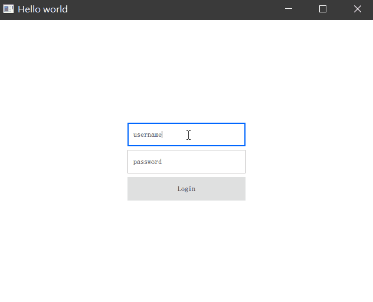

# Defining QML Types from C++

除了向 QML 注入一个全局的上下文对象以外，Qt Quick 还提供了一种机制是提供一个 QML 可以创建的类型，任何 QObject 的子类都可以注册为 QML 对象类型。一旦注册了一个类，就可以像其他对象一样在 QML 中创建并使用它。

## 创建一个自定义 C++ 类型到 QML 中

QML 中没有对象可以对剪切板做很好的支持，但是 Qt C++ 类中包含了剪切板相关的能力。我们创建一个复用了剪切板对象能力的 QObject 子类，然后将他注册给 QML 使用。

```C++
#ifndef CLIPBOARD_H
#define CLIPBOARD_H

#include <QObject>
#include <QClipboard>
#include <QGuiApplication>

class Clipboard : public QObject
{
    Q_OBJECT
public:
    explicit Clipboard(QObject *parent = nullptr)
        : QObject(parent) {
        clipboard = QGuiApplication::clipboard();
    }
    Q_INVOKABLE void setText(QString text) {
        clipboard->setText(text, QClipboard::Clipboard);
    }
    Q_INVOKABLE QString getText() {
        return clipboard->text(QClipboard::Clipboard);
    }
private:
    QClipboard *clipboard;
};

#endif // CLIPBOARD_H
```

该类功能非常简单 ，使用 QClipboard 对象，创建两个方法 setText（设置剪切板）和 getText（获取剪切板内容）来提供外部使用。

在 main.cpp 中，我们将自定义的这个 QObject 子类注册给 QML 系统。

```C++
// 实例化 Clipboard 类对象并注册到 QML 中
Clipboard clipboard;
qmlRegisterType<Clipboard>("Clipboard", 1, 0, "Clipboard");
```

qmlRegisterType 模板方法包含四个参数

 - 第一个是在 QML 中用什么名字导入这个模块
 - 第二个是主版本号
 - 第三个是次版本号
 - 第四个是导入该模块后你应该以什么名称创建这个组件

一切就绪，在 QML 中，我们首先导入这个自定义对象：

```QML
// 注意这里的名称和版本号
import Clipboard 1.0
```

随后在我们需要的地方创建一个 Clipboard 对象：

```
Clipboard {
    id: clipboard
}
```

在需要使用到剪切板的位置调用 `clipboard.setText()` 即可设置系统剪切板的内容，比如我们在前面示例中的登录窗口中，点下 Login 按钮时调用他的 setText 方法。

```QML
Button {
    Layout.fillWidth: true
    text: 'Login'
    enabled: !authManager.loggedIn
    onClicked: {
        // 设置剪切板内容为 用户名 -- 密码
        clipboard.setText(inputUsername.text + '--' + inputPassword.text)
    }
}
```

运行程序后，在输入框随便输入一些内容，点击 Login 按钮，用户名和密码就会设置到剪切板中了。



## 总结

这是一个最简单不过的注册自定义 C++ 类型到 QML 的示例了。实际开发场景中，我们会有很多场景需要将自定义的对象注册给 QML 使用，除了这种方式外在我们前面介绍的 [QML 与 C++ 交互](Integrating%20QML%20and%20C++.md) 一文中还可以注册一些单例对象、不可创建的纯数据形对象到 QML 中。基本上满足了我们所有的交互需求。