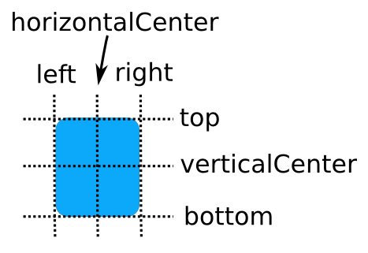
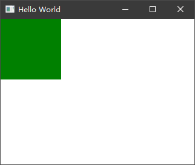
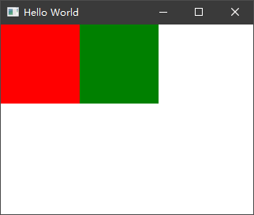
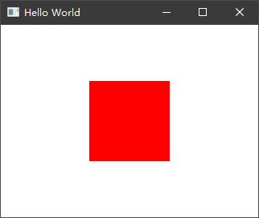
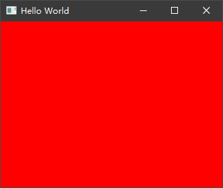
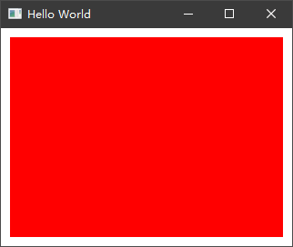
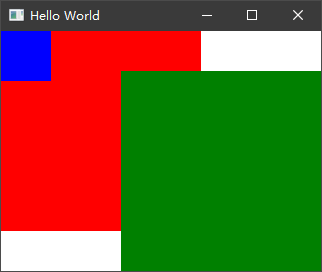

# Anchors 锚点（Anchor-based Layout）

## 基本认知

像其他 UI 框架一样，QML 的组件允许我们通过固定的 x、y 坐标来控制位置的显示，但这样未免有些死板切不容易控制。QML 中提出了一个比较新颖的布局方式（这里叫布局可能不太合适，暂时这样表示，如有更好的表达方式将会修正）就是“Anchors”锚点。每一个 Item 都具有 7 个锚线（Anchor lines）包括上方 top、下方 bottom、左侧 left、右侧 right、垂直中心 verticalCenter、水平中心 horizontalCenter 和基线 baseline。下图演示了一个 Item 几个方向的基准线：



## 以指定节点为基准

默认情况下，一个 Item 放置到一个 Window 中是没有具体定位的，他们都将父级的左上角作为起点。如下所示：

```
import QtQuick 2.12
import QtQuick.Window 2.12

Window {
    visible: true
    width: 320
    height: 240
    title: qsTr('Hello World')

    Rectangle {
        width: 100
        height: 100
        color: 'red'
    }

    Rectangle {
        width: 100
        height: 100
        color: 'green'
    }
}
```


可以看到，两个 Rectangle 重叠了，因为我们并没有指定它们的位置属性。如果希望绿色的 Rectangle 在红色的 Rectangle 右侧，那么通过 anchors 属性来控制就非常简单了。

```QML
import QtQuick 2.12
import QtQuick.Window 2.12

Window {
    visible: true
    width: 320
    height: 240
    title: qsTr('Hello World')

    Rectangle {
        id: rect1
        width: 100
        height: 100
        color: 'red'
    }

    Rectangle {
        id: rect2
        width: 100
        height: 100
        color: 'green'
        anchors.left: rect1.right
    }
}
```

我们通过设置 rect2 的 `anchors.left` 属性，指定了 rect2 的 left 以 rect1 的 right 为基准，这样 rect2 就会排列在 rect1 的右侧，如下图所示：



同理，如果你希望 rect2 在 rect1 下方，则修改 `anchors.left: rect1.right` 为 `anchors.top: rect1.bottom`，这里不再过多代码演示，可以自己写一些代码来进行演示。

## 居中

除了上方、下方、左侧、右侧，我们还可以指定他们根据某个 Item 的垂直中心和水平中心进行布局。去掉绿色的矩形仅保留一个红色的矩形，我们让红色的矩形在 Window 的中心显示，可以这样来实现：

```QML
import QtQuick 2.12
import QtQuick.Window 2.12

Window {
    visible: true
    width: 320
    height: 240
    title: qsTr('Hello World')

    Rectangle {
        id: rect1
        width: 100
        height: 100
        color: 'red'
        anchors.verticalCenter: parent.verticalCenter
        anchors.horizontalCenter: parent.horizontalCenter
    }
}
```

这里的 parent 代表这个矩形的父节点，我们指定了矩形的水平中心和垂直中心都是基于父节点来做参考的，这样就实现了居中：



像这样常用的功能，QML 早就考虑到了，我们可以通过 `anchors.centerIn` 来控制居中显示在哪个父节点中。

```QML
import QtQuick 2.12
import QtQuick.Window 2.12

Window {
    visible: true
    width: 320
    height: 240
    title: qsTr('Hello World')

    Rectangle {
        id: rect1
        width: 100
        height: 100
        color: 'red'
        anchors.centerIn: parent
    }
}
```

## 填充

上面代码效果是一样的。除了 centerIn，还有一个比较常用的 anchors.fill，表示要填充到哪个父节点中。比如我们希望红色的矩形填充整个窗口，则去掉宽高属性后，指定 anchors.fill 为 parent 即可：

```QML
import QtQuick 2.12
import QtQuick.Window 2.12

Window {
    visible: true
    width: 320
    height: 240
    title: qsTr('Hello World')

    Rectangle {
        id: rect1
        width: 100
        height: 100
        color: 'red'
        anchors.fill: parent
    }
}
```

效果如下：



## 边距

有时我们希望填充后具有一定边距，那么可以通过 anchors.margins 来控制填充后的边距：

```QML
import QtQuick 2.12
import QtQuick.Window 2.12

Window {
    visible: true
    width: 320
    height: 240
    title: qsTr('Hello World')

    Rectangle {
        id: rect1
        width: 100
        height: 100
        color: 'red'
        anchors.fill: parent
        anchors.margins: 10
    }
}
```

效果图：



如果你希望只控制一边的边距，可以指定 leftMargin、rightMargin、topMargin 或 bottomMargin 属性来达到目的。

## 其他

使用锚点布局必须是有父子关系的节点或是同级节点，不能跳级，也不能跨节点。比如下面的示例中，我们希望 rect3 居中显示在 rect2 中，但是由于他们并不是父子关系也不是同一级别的，导致设置失效：

```QML
import QtQuick 2.12
import QtQuick.Window 2.12

Window {
    visible: true
    width: 320
    height: 240
    title: qsTr('Hello World')

    Rectangle {
        id: rect1
        width: 200
        height: 200
        color: 'red'
        Rectangle {
            id: rect3
            height: 50
            width: 50
            color: 'blue'
            anchors.centerIn: rect2
        }
    }

    Rectangle {
        id: rect2
        width: 200
        height: 200
        anchors.right: parent.right
        anchors.bottom: parent.bottom
        color: 'green'
    }
}
```

结果图：



## 总结

以上为 Anchors 锚点方式布局的一些常用示例和说明，更多可以参考 Qt 官方文档：https://doc.qt.io/qt-5/qtquick-positioning-anchors.html

