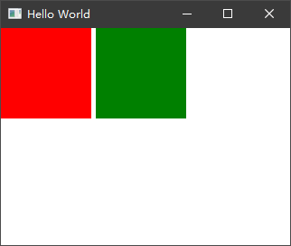
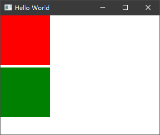
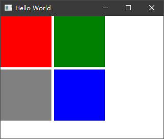
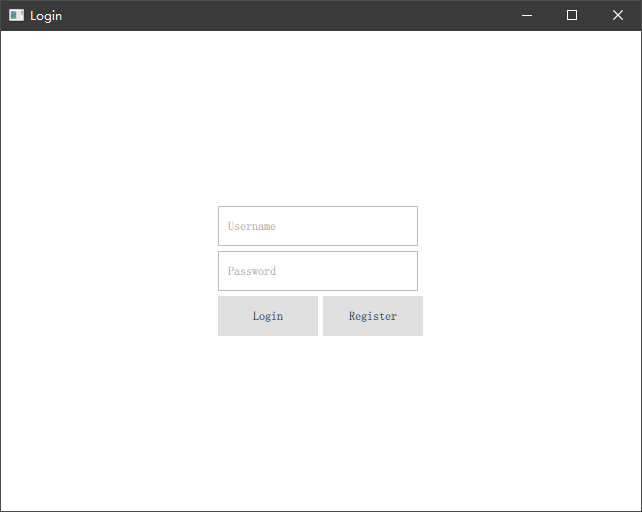
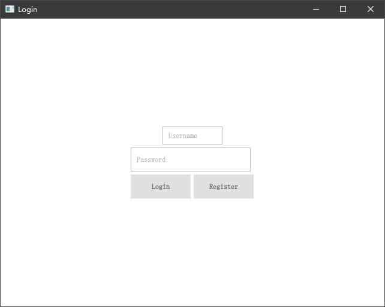

## Layouts 布局

锚点布局虽然已经可以满足大部分场景，但是当你去编写一个复杂界面的时候，使用锚点布局你会发现将产生大量的 anchors... 代码，各 UI 显示资源高度关联耦合，一个变动可能会影响其他的项目变动。这不是我们希望看到的，除了锚点布局外，QML 也有像其他 UI 框架一样的 Layouts 方式来进行布局。常用的 Layouts 布局器有垂直布局 ColumnLayout、水平布局 RowLayout、网格布局 GridLayout。还有不太常用到的如 StackLayout。

### 1）水平布局

上文中第一个示例我们用锚点的方式让两个矩形左右布局的方式显示，同样，通过 RowLayout 我们可以达到同样的目的：

```QML
import QtQuick 2.12
import QtQuick.Window 2.12
import QtQuick.Layouts 1.12

Window {
    visible: true
    width: 320
    height: 240
    title: qsTr('Hello World')

    RowLayout {
        Rectangle {
            id: rect1
            width: 100
            height: 100
            color: 'red'
        }

        Rectangle {
            id: rect2
            width: 100
            height: 100
            color: 'green'
        }
    }
}
```

效果图：



可以看到，我们删掉了 anchors 相关的代码，外部使用一个 RowLayout 将两个矩形包了起来，两个矩形以水平铺开的方式做展示，而且不难发现，使用 RowLayout 后会让子项目中间具有一个默认的间距。这也是布局属性中一个经常使用到的属性，如果你希望间距为 0 或者加大间距，则指定 RowLayout 的 spacing 属性即可，其值为像素值。

> 注意：要使用 Layouts 布局相关能力，需要导入 `QtQuick.Layouts` 相关类型。

### 2）垂直布局

同样如果你希望两个矩形垂直排布，将 RowLayout 修改为 ColumnLayout 即可：

```QML
import QtQuick 2.12
import QtQuick.Window 2.12
import QtQuick.Layouts 1.12

Window {
    visible: true
    width: 320
    height: 240
    title: qsTr('Hello World')

    ColumnLayout {
        Rectangle {
            id: rect1
            width: 100
            height: 100
            color: 'red'
        }

        Rectangle {
            id: rect2
            width: 100
            height: 100
            color: 'green'
        }
    }
}
```

效果图：



### 3）网格布局

类似的 GridLayout 提供了网格方式布局的能力：

```QML
import QtQuick 2.12
import QtQuick.Window 2.12
import QtQuick.Layouts 1.12

Window {
    visible: true
    width: 320
    height: 240
    title: qsTr('Hello World')

    GridLayout {
        columns: 2 // 每行显示2列内容

        Rectangle {
            id: rect1
            width: 100
            height: 100
            color: 'red'
        }

        Rectangle {
            id: rect2
            width: 100
            height: 100
            color: 'green'
        }

        Rectangle {
            id: rect3
            width: 100
            height: 100
            color: 'gray'
        }

        Rectangle {
            id: rect4
            width: 100
            height: 100
            color: 'blue'
        }
    }
}
```

我们指定了 GridLayout 每行只显示 2 列内容，效果图：



### 4）嵌套

通过 Layouts，我们可以很方便的创建一个我们需要的布局体系，以一个非常常用的登陆对话框为例，我们做一个实操：

```QML
import QtQuick 2.12
import QtQuick.Window 2.12
import QtQuick.Layouts 1.12
import QtQuick.Controls 2.12

Window {
    visible: true
    width: 640
    height: 480
    title: qsTr('Login')

    ColumnLayout {
        anchors.centerIn: parent
        TextField {
            placeholderText: 'Username'
        }
        TextField {
            placeholderText: 'Password'
        }
        RowLayout {
            Button {
                text: 'Login'
            }
            Button {
                text: 'Register'
            }
        }
    }
}
```

展示效果：



首先我们外部使用了一个 ColumnLayout 将所有关键内容包在一起，并设置该布局居中显示在窗口上。布局决定子项目是上下排布的，我们先放入了两个 TextField（输入控件）随后又增加了一个 RowLayout 嵌套在 ColumnLayout 中并在里面放置了两个 Button（按钮） 左右排布，最终达到了我们想要的效果。

大部分场景我们都需要嵌套使用 Layouts 才能满足界面布局上的需求。而如果使用锚点方式布局，会有很多的冗余代码。

### 5）子项目附加属性

上面的示例中，我们并没有控制控件的各类属性，比如宽、高、位置排布等，如果我们希望修改子项目的这些属性，需要使用 Layouts 给定的 `Layout.*` 属性，而不能直接使用控件原有的 width、height，更不能在 Layouts 子项目中使用锚点 `anchors` 关键字，否则我们会得到一些警告并且设置可能会失效，下面例子演示了错误的用法：

```QML
import QtQuick 2.12
import QtQuick.Window 2.12
import QtQuick.Layouts 1.12
import QtQuick.Controls 2.12

Window {
    visible: true
    width: 640
    height: 480
    title: qsTr('Login')

    ColumnLayout {
        anchors.centerIn: parent
        TextField {
            width: 100 // 无效
            height: 30 // 无效
            anchors.horizontalCenter: parent.horizontalCenter // 无效且警告
            placeholderText: 'Username'
        }
        TextField {
            placeholderText: 'Password'
        }
        RowLayout {
            Button {
                text: 'Login'
            }
            Button {
                text: 'Register'
            }
        }
    }
}
```

我们给 ColumnLayout 的子项目指定了 width、height 和 anchors.horizontalCenter 属性，希望控制其宽高和居中属性。但是我们得到了如下警告并且界面并不是会随着我们代码修改而得到想象的改变：

```
qrc:/main.qml:14:9: QML TextField: Detected anchors on an item that is managed by a layout. This is undefined behavior; use Layout.alignment instead.
```

警告中描述在一个使用了 Layouts 布局管理器管理的项目中错误的使用了 anchors 来进行布局，这是一个未定义行为，需要使用 Layout.alignment 来控制居中属性。虽然宽高并没有得到警告，但是我们看到也是并不生效的。正确的做法应该是这样：

```QML
import QtQuick 2.12
import QtQuick.Window 2.12
import QtQuick.Layouts 1.12
import QtQuick.Controls 2.12

Window {
    visible: true
    width: 640
    height: 480
    title: qsTr('Login')

    ColumnLayout {
        anchors.centerIn: parent
        TextField {
            Layout.preferredWidth: 100 // width
            Layout.preferredHeight: 30 // height
            Layout.alignment: Qt.AlignHCenter // horizontalCenter
            placeholderText: 'Username'
        }
        TextField {
            placeholderText: 'Password'
        }
        RowLayout {
            Button {
                text: 'Login'
            }
            Button {
                text: 'Register'
            }
        }
    }
}
```

效果：



Layout.* 附加属性除了推荐宽高、排列属性以外还有一些像边距、填充宽高、最大宽高等属性，更多可参考 Qt 官方文档：https://doc.qt.io/qt-5/qml-qtquick-layouts-layout.html

### 6）总结

Layouts 与 Anchors 不同的是，你可以通过一个外部布局管理器来统一管理子项目的排列，而不需要对每个子项目指定锚点的方式来做排布，如果有个别子项需要单独属性，可通过 Layout.* 附加属性来控制子项目的展示规则，而且在一些自适应布局窗口中，Layouts 的表现更好。也大大降低了 UI 开发中布局的一些繁琐问题，这里也推荐大家使用 Layouts 方式布局来设计你的 UI 界面。
