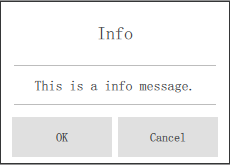
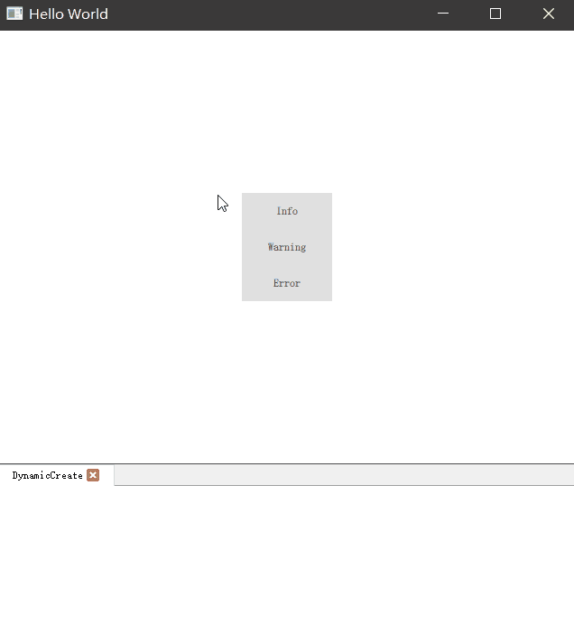

# Dynamic QML Object Creation from JavaScript

除了静态的在 QML 文件中创建一些已知的对象外，我们还可以通过 Qt Quick 提供的动态创建组件功能来创建一个组件为可使用的对象。这在某些场景下非常实用，比如我们希望动态创建一个 Dialog 对话框或自定义的 MessageBox 对话框。它们的内容是每次弹出时跟随传入的参数动态变动的，而声明式创建可能无法达到我们的需求。

动态创建的对象有时是需要我们手动进行内存管理的，如果在创建时你明确生命了组件的依附节点，那么组件的生命周期可以托管给 QML 帮我们完成。

## 从文件动态创建对象

一些传统的 Windows、macOS 应用程序，系统都会提供一些全局的对话框用来显示一些内容，Qt Quick 也提供了类似的功能比如 Dialog，它基于 Popup 实现，内置了一些按钮、标题和内容的展示。但有时他的样式可能并不能满足我们的需求，所以我们可以基于 Popup 自定义一个模仿系统 MessageBox 的弹窗，显示标题、内容和确定取消按钮。

通过不同的事件响应来动态创建它们实现一些基础业务能力，首先来看一下我们自定义的 Popup 组件。

```QML
import QtQuick 2.0
import QtQuick.Layouts 1.12
import QtQuick.Controls 2.12

Popup {
    anchors.centerIn: parent
    modal: true

    property string title: ''
    property string content: ''

    signal confirm
    signal cancel

    onClosed: {
        console.log('Message box popup closed.')
        destroy()
    }

    Component.onDestruction: {
        console.log('Message box popup destroyed.')
    }

    ColumnLayout {
        anchors.fill: parent
        Label {
            Layout.preferredHeight: 40
            Layout.fillWidth: true
            text: title
            font.pixelSize: 18
            horizontalAlignment: Text.AlignHCenter
            verticalAlignment: Text.AlignVCenter
        }
        ToolSeparator {
            Layout.fillWidth: true
            orientation: Qt.Horizontal
        }
        Label {
            Layout.fillHeight: true
            Layout.fillWidth: true
            text: content
            font.pixelSize: 14
            wrapMode: Text.WrapAnywhere
            horizontalAlignment: Text.AlignHCenter
            verticalAlignment: Text.AlignVCenter
        }
        ToolSeparator {
            Layout.fillWidth: true
            orientation: Qt.Horizontal
        }
        RowLayout {
            Layout.fillWidth: true
            Layout.preferredHeight: 35
            Button {
                Layout.fillWidth: true
                text: qsTr('OK')
                onClicked: {
                    confirm()
                    close()
                }
            }
            Button {
                Layout.fillWidth: true
                text: qsTr('Cancel')
                onClicked: {
                    cancel()
                    close()
                }
            }
        }
    }
}
```

它基于 Popup 制作，显示效果是这样的：



我们提供了连个属性一个是 title 用来显示标题，一个是 content 用来显示提示具体内容。

除了属性我们还提供了俩个信号，一个是 confirm 用以在点击了确定按钮后发出信号通知外部，另外一个是 cancel 则是点击取消按钮会发出的信号。分别在两个 Button 的 onClicked 信号处理程序中，发射了不同的信号并关闭 Popup 窗口。

另外我们添加了 Popup closed 信号的处理程序，在处理程序中我们检测如果已经关闭则自动销毁对象：

```QML
onClosed: {
    console.log('Message box popup closed.')
    destroy()
}
```

另外在组件完全销毁后，我们打印了一条控制台消息用来确认是否已经被销毁：

```QML
Component.onDestruction: {
    console.log('Message box popup destroyed.')
}
```

在 main.qml 中，我们可以这样来使用它们：

```QML
import QtQuick 2.12
import QtQuick.Window 2.12
import QtQuick.Controls 2.12

Window {
    visible: true
    width: 640
    height: 480
    title: qsTr("Hello World")

    property var component: undefined

    Component.onCompleted: {
        component = Qt.createComponent('qrc:/MessageBox.qml')
    }

    Column {
        anchors.centerIn: parent
        Button {
            text: 'Info'
            onClicked: {
                if (component.status === Component.Ready) {
                    const infoObj = component.createObject(Window.window, {
                        title: 'Info',
                        content: 'This is a info message.'
                    })
                    infoObj.confirm.connect(function () {
                        console.log('Clicked confirm button from info message box.')
                    })
                    infoObj.open()
                }
            }
        }
        Button {
            text: 'Warning'
            onClicked: {
                if (component.status === Component.Ready) {
                    const warningObj = component.createObject(Window.window, {
                        title: 'Warning',
                        content: 'This is a warning message.'
                    })
                    warningObj.confirm.connect(function () {
                        console.log('Clicked confirm button from warning message box.')
                    })
                    warningObj.open()
                }
            }
        }
        Button {
            text: 'Error'
            onClicked: {
                if (component.status === Component.Ready) {
                    const errorObj = component.createObject(Window.window, {
                        title: 'Error',
                        content: 'This is a error message.'
                    })
                    errorObj.confirm.connect(function () {
                        console.log('Clicked confirm button from error message box.')
                    })
                    errorObj.open()
                }
            }
        }
    }
}
```

首先我们在窗口加载完毕时，基于 MessageBox.qml 文件使用 `Qt.createComponent` 接口创建了一个组件并将它保存在全局的 component 属性中，此时他还是不可用的：

```QML
Component.onCompleted: {
    component = Qt.createComponent('qrc:/MessageBox.qml')
}
```

界面中我们放置了三个按钮，分别显示不同标题和内容的 MessageBox，使用 `component.createObject` 方法可以将创建好的组件实例化为一个具体的对象。

```QML
if (component.status === Component.Ready) {
    // 实例化对象
    const infoObj = component.createObject(Window.window, {
        title: 'Info',
        content: 'This is a info message.'
    })
    infoObj.confirm.connect(function () {
        console.log('Clicked confirm button from info message box.')
    })
    infoObj.open()
}
```

在对象实例化过程中，通过第一个参数我们指定了该对象的父节点是谁（我们指定了 Window.window 就是当前窗口），通过第二个参数将我们需要的不同 title 和 content 传递给该对象，使其构建时就可以获得这两个参数从而显示在界面上。

在对象创建完毕后，我们调用了对象中已有信号 confirm 的 connect 方法将其连接到一个我们写好的 JavaScript function 中，这样，在内部触发了 confirm 信号后，我们的方法会自动被调用。

另外两个按钮如法炮制，最终效果如下：



通过下方控制台打印的日志我们可以看出，当窗口弹出后我们点击了确定按钮，它的调用步骤如下：

```
// 首先调用了我们外部添加的 confirm 信号处理函数
qml: Clicked confirm button from info message box.
// 然后 Popup closed 信号处理程序被调动
qml: Message box popup closed.
// 最后 Popup destruction 被调用表示已经被销毁
qml: Message box popup destroyed.
```

当然，如果我们在打开这个 Popup 后并没有点击任何按钮而是直接关闭了窗口，同样 `qml: Message box popup destroyed.` 内容一样会被打印的，因为在创建对象时，我们指定了其父节点是主窗口，当主窗口关闭后，会附带销毁所有的子项目。这也是一种托管销毁的机制。

## 从字符串动态创建对象

除了从文件中创建一个组件并实例化对象以外，我们还可以通过纯字符串的方式创建一个组件，但是这种方式明显会造成代码难以阅读，我们并不推荐使用，这里仅仅从官网 Copy 一份示例提供大家参考：

```QML
var newObject = Qt.createQmlObject('import QtQuick 2.0; Rectangle {color: "red"; width: 20; height: 20}',
                                   parentItem,
                                   "dynamicSnippet1");
```

## 删除动态创建的对象

如果一个组件对象频繁的被创建，那你需要考虑动态的去销毁他们，否则可能会造成一些内存泄露，直到应用程序生命周期结束这些内容才会被回收。上面的示例中我们在窗口关闭是调用了窗口自身的 `destroy()` 来销毁自己，从外部，你一样可以调用对象的 `destroy()` 接口来销毁对象：

```
if (component.status === Component.Ready) {
    const infoObj = component.createObject(Window.window, {
        title: 'Info',
        content: 'This is a info message.'
    })
    infoObj.confirm.connect(function () {
        console.log('Clicked confirm button from info message box.')
    })
    infoObj.open()
    infoObj.destroy()
}
```

以上代码没有实质性意义，在组件打开后既被销毁，可能无法展示，目的是为了演示如何在外部销毁对象。

## 总结

动态创建组件对象的方法在实际开发中会经常使用到，除了一些常规控件以外，我们也可以将一个独立窗口保存为单独的 .qml 文件然后通过以上方式动态创建他们，但是窗口的维护和管理远比控件要繁琐，除非特殊原因，否则不要使用动态创建窗口的方式来管理窗口。
