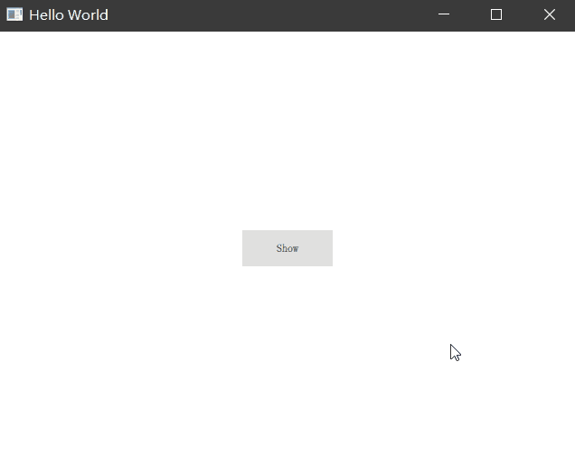

# Inside Window

Qt Quick 创建窗口的方式有很多种，最简单的就是在一个 Window 中声明式创建另外一个窗口，并在需要的时候展示它们。

## 子窗口创建

```QML
import QtQuick 2.12
import QtQuick.Window 2.12
import QtQuick.Controls 2.12

Window {
    visible: true
    width: 640
    height: 480
    title: qsTr("Hello World")

    Window {
        id: childWindow
        width: 480
        height: 360
        title: 'Child Window'
        modality: Qt.WindowModal
        Label {
            anchors.centerIn: parent
            font.pixelSize: 20
            text: 'This is a child window'
        }
    }

    Button {
        text: 'Show'
        anchors.centerIn: parent
        onClicked: {
            childWindow.show()
        }
    }
}
```

上面的示例中，我们在主窗口 Window 中又新建了一个 Window，主窗口显示时，内部的这个 Window 并不会立即展示，它默认是隐藏的。

当我们点击按钮 Show 时，子窗口随之显示。



我们通过 `modality` 属性设置了这个子窗口为模态窗台，像传统模态窗口一样，除非我们关闭了子窗口，否则主窗口是无法被操作的。
