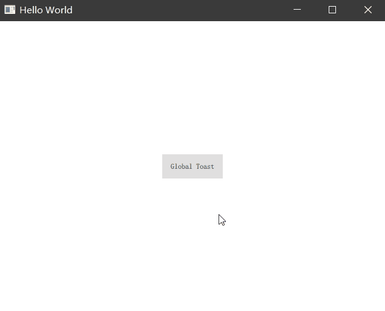

# Registering Singleton Objects with a Singleton Type

通过前面的学习我们发现，Qt Quick 更像是一个单页面应用，像 Dialog、Popup 等这类控件都是在窗口内部弹出的，当我们需要制作一个超出窗口范围的显示区域时就需要单独使用一个窗口来表示了，这也符合桌面程序设计的原则。

有些窗口展示的样式是非常固定的，比如它可能是一个全局的居中 Toast 提示，我们没必要在每次显示它的时候都去动态创建它，这无疑会消耗一些不需要重复操作的资源。它只是内部内容可能会发生改变，我们可以通过一个单例窗口保证它只被创建一次，在它展示的时候我们仅仅修改其内部要显示的内容即可。让我们开始创建一个自己的全局 Toast 提示。

## 创建单例窗口

在创建这个单例窗口时，你还是需要先创建一个 Window 并将他独立在一个文件中，不同的是我们需要在文件的开头使用 `pragma Singleton` 关键字描述它是单例形式存在的，代码如下：

```QML
pragma Singleton

import QtQuick 2.12
import QtQuick.Window 2.12
import QtQuick.Controls 2.12
import QtQuick.Layouts 1.12

Window {
    id: root
    visible: true
    width: toastContainer.width + 60
    height: toastContainer.height
    x: (Screen.width - width) / 2 + Screen.virtualX
    y: (Screen.height - height) / 2 + Screen.virtualY
    title: qsTr("Global Toast")
    color: "transparent"
    flags: {
        if (Qt.platform.os === 'windows')
            Qt.Popup | Qt.FramelessWindowHint | Qt.WindowStaysOnTopHint
        else
            Qt.Popup | Qt.FramelessWindowHint
    }

    property string content: ""
    property real time: defaultTime
    readonly property real defaultTime: 3000
    readonly property real fadeTime: 300

    function displayText(text) {
        content = text
        root.show()
        anim.restart()
    }

    Rectangle {
        width: childrenRect.width
        height: childrenRect.height
        color: "#CC1E1E1E"
        radius: 4
        RowLayout {
            spacing: 0
            Item { Layout.preferredWidth: 30 }
            ColumnLayout {
                id: toastContainer
                spacing: 0
                Item { Layout.preferredHeight: 20 }
                Label {
                    color: "#FFFFFF"
                    text: content
                    font.pixelSize: 18
                }
                Item { Layout.preferredHeight: 20 }
            }
            Item { Layout.preferredWidth: 30 }
        }
    }

    SequentialAnimation on opacity {
        id: anim
        running: false

        NumberAnimation {
            to: 1
            duration: fadeTime
        }
        PauseAnimation {
            duration: time - 2 * fadeTime
        }
        NumberAnimation {
            to: 0
            duration: fadeTime
        }
        onRunningChanged: {
            if (!running)
                root.hide();
            else
                root.show();
        }
    }
}
```

在这个窗口内部，真正用来显示内容的是一个 Label 控件，其他都是一些辅助功能，比如我们制作了一个动画效果，在窗口隐藏时使用了渐变透明度的效果。

这个窗口组件提供了一个 `displayText` 的函数，用来显示你要显示的文本内容，当该接口被调用，窗口根据屏幕坐标自动居中展示，并且开启一个定时器在几秒后自动隐藏窗口并带有动画效果。

## 将全局窗口注册为单例

UI 部分资源完成后，我们需要使用 C++ 将这个单例窗口类型注册给 QML，这样其他文件才能使用，我们不能再像传统的直接声明式创建组件的方式来实例化这个对象了：

```C++
// main.cpp
#include <QGuiApplication>
#include <QQmlApplicationEngine>

int main(int argc, char *argv[])
{
    QCoreApplication::setAttribute(Qt::AA_EnableHighDpiScaling);
    QGuiApplication app(argc, argv);
    QQmlApplicationEngine engine;

    // 注册窗口为单例类型
    qmlRegisterSingletonType(QUrl("qrc:/GlobalToast.qml"), "GlobalToast", 1, 0, "GlobalToast");

    const QUrl url(QStringLiteral("qrc:/main.qml"));
    engine.load(url);

    return app.exec();
}
```

通过我们之前学习过的注册自定义类型的一种单例方式，我们将自己的 qml 组件使用 `qmlRegisterSingletonType` 接口注册为单例。

接下来在其他 QML 文件中我们需要使用时，首先要导入这个单例组件：

```QML
// main.qml
import GlobalToast 1.0
```

当你要使用这个窗口时，像下面这样直接访问单例窗口的 displayText 接口就可以了。

```QML
Button {
    text: 'Global Toast'
    anchors.centerIn: parent
    onClicked: {
        // 直接使用窗口实例，不需要单独创建
        GlobalToast.displayText('This is a global taost.')
    }
}
```

展示效果：



## 总结

通过单例窗口，我们可以重复使用一些窗口资源而不需要频繁的创建和销毁他们，这也带来了程序性能上的小小提升。不建议将一些不会频繁使用的窗口注册为单例窗口，你可以使用内联窗口或者动态创建的方式来使用他们。
